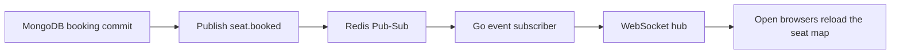

# Cinema ticket booking system

A small cinema booking project built with Go, Vue, MongoDB, and Redis. It is being developed in
small, tested milestones so each part can be explained and reviewed on its own.

## Current state

- Docker Compose starts the web app, API, MongoDB replica set, and Redis.
- The API seeds two screenings and exposes their seat layouts.
- The Vue page loads showtimes from the API and displays an accessible seat grid.
- Google OAuth creates or updates a user in MongoDB and stores a 24-hour session in Redis.
- An authenticated user can hold a seat in Redis for 5 minutes and release it early.
- The seat map shows current locks and identifies the lock owned by the signed-in user.
- WebSocket updates keep open seat maps in sync when a hold is created, released, or expires.
- Mock payment confirmation writes the booking and audit log in one MongoDB transaction.
- Redis Pub-Sub broadcasts a versioned `seat.booked` event after the transaction commits.
- Users have exact `USER` or `ADMIN` roles, and every admin API enforces the role on the server.
- The admin dashboard lists bookings, filters them by movie or status, and shows audit events.

## Run locally

Docker Desktop is the only requirement for running the whole stack.

```powershell
Copy-Item .env.example .env
docker compose up --build
```

Open [http://localhost:3000](http://localhost:3000). The API is also available on
[http://localhost:8080](http://localhost:8080).

Stop the stack without deleting its data:

```powershell
docker compose down
```

## Google sign-in setup

The app starts without Google credentials, but the sign-in button stays disabled. To enable it:

1. Open the [Google Auth Platform Clients page](https://console.cloud.google.com/auth/clients) and
   create a **Web application** client.
2. Add this exact authorized redirect URI:
   `http://localhost:3000/api/v1/auth/google/callback`
3. Keep the app in testing mode and add your Google account as a test user.
4. Copy `.env.example` to `.env`, then set `GOOGLE_CLIENT_ID` and `GOOGLE_CLIENT_SECRET`.
5. Recreate the API container with `docker compose up --build -d api web`.

Do not commit `.env` or the client secret. Production deployments must use HTTPS and set
`COOKIE_SECURE=true`.

## Admin setup

New Google accounts receive the `USER` role. To make your account an administrator, add its exact
Google email to `.env` and rebuild the API:

```dotenv
ADMIN_EMAILS=your-google-email@example.com
```

```powershell
docker compose up --build -d api web
```

Multiple administrator emails can be separated with commas. At API startup, existing users without
a role are backfilled as `USER`, and exact matching emails from `ADMIN_EMAILS` are promoted to
`ADMIN`. Normal sign-in never overwrites an existing role. Open
[http://localhost:3000/admin](http://localhost:3000/admin), or use the **Admin** link shown after an
administrator signs in.

The frontend route guard improves the user experience, but it is not the security boundary. The Go
API reloads the current user from MongoDB for each authenticated request and returns `403` unless the
stored role is exactly `ADMIN`.

## API available now

| Method | Path | Purpose |
| --- | --- | --- |
| `GET` | `/api/v1/health/live` | API process health |
| `GET` | `/api/v1/health/ready` | MongoDB and Redis readiness |
| `GET` | `/api/v1/auth/config` | Whether Google sign-in is configured |
| `GET` | `/api/v1/auth/google` | Start Google OAuth |
| `GET` | `/api/v1/auth/google/callback` | Google OAuth callback |
| `GET` | `/api/v1/auth/me` | Current session user |
| `POST` | `/api/v1/auth/logout` | Delete the current session |
| `GET` | `/api/v1/screenings` | Upcoming screenings |
| `GET` | `/api/v1/screenings/:screeningID/seats` | Seat map for one screening |
| `POST` | `/api/v1/screenings/:screeningID/seats/:seatID/lock` | Hold a seat for the current user |
| `DELETE` | `/api/v1/screenings/:screeningID/seats/:seatID/lock` | Release the current user's hold |
| `GET` | `/api/v1/screenings/:screeningID/seat-events` | WebSocket stream for seat changes |
| `POST` | `/api/v1/bookings` | Confirm the current user's held seat |
| `GET` | `/api/v1/admin/bookings` | Admin booking list with movie/status filters and pagination |
| `GET` | `/api/v1/admin/audit-logs` | Admin audit log with event filter and pagination |

The WebSocket event is only a change notification. After receiving it, the web app reloads the
seat map so MongoDB remains authoritative for booked seats and Redis remains authoritative for
temporary holds. Redis keyspace notifications must include string, generic, and expiry events;
Docker Compose configures this automatically.

## Booking confirmation flow

1. The authenticated user holds an available seat in Redis for 5 minutes.
2. Confirmation atomically changes that lock into a short-lived claim token. A stale release
   request cannot delete a newer claim.
3. One MongoDB transaction changes the embedded seat from `AVAILABLE` to `BOOKED`, inserts the
   booking, and appends a `BOOKING_SUCCESS` audit log.
4. The unique booked-seat index and conditional seat update are the final double-booking guards.
5. Only after MongoDB commits does the API delete the Redis claim and publish `seat.booked`.

Payment is deliberately mocked because the assignment evaluates booking correctness rather than a
real payment gateway. If the MongoDB transaction fails, the API restores the user's original hold
for whatever time remained.

## Audit events

The audit collection records important server-side events:

| Event | When it is written |
| --- | --- |
| `BOOKING_SUCCESS` | A booking transaction commits successfully |
| `BOOKING_TIMEOUT` | A temporary Redis seat hold expires |
| `SEAT_RELEASED` | A user releases their own active hold |
| `SYSTEM_ERROR` | An unexpected seat-lock storage operation fails |

Expected business conflicts, such as choosing a seat already held by another user, are not logged
as system errors.

## Message Queue use case

This project chooses **Redis Pub-Sub**, one of the message queue options allowed by the assignment.
It is used for a real booking event rather than running an unused broker:



The event includes `booking_id`, `screening_id`, `seat_id`, status, event version, and occurrence
time. It is published only after the MongoDB transaction commits. A failed booking never emits a
booked event, while a Redis publish failure does not roll back a booking that is already durable.

To watch the channel while testing a booking in the browser:

```powershell
docker compose exec redis redis-cli SUBSCRIBE cinema:seat-events:v1
```

After confirming a seat, the subscriber shows a `seat.booked` JSON message and other open browser
windows change that seat to `BOOKED`. Redis Pub-Sub uses
[at-most-once delivery](https://redis.io/docs/latest/develop/pubsub/) and does not keep old events.
MongoDB remains the source of truth, so reconnecting clients reload the current seat map instead of
trying to rebuild state from Pub-Sub history.

## Tests

Backend:

```powershell
cd backend
go test ./...
```

Frontend:

```powershell
cd frontend
npm install
npm run lint
npm run test:unit -- --run
npm run build
```

## Project layout

```text
backend/    Go API and database code
frontend/   Vue application and Nginx config
docker-compose.yml
```
