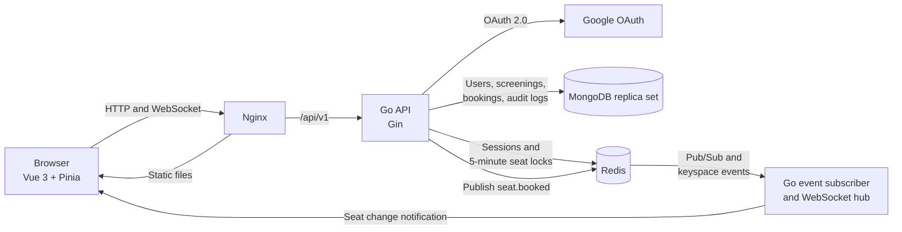
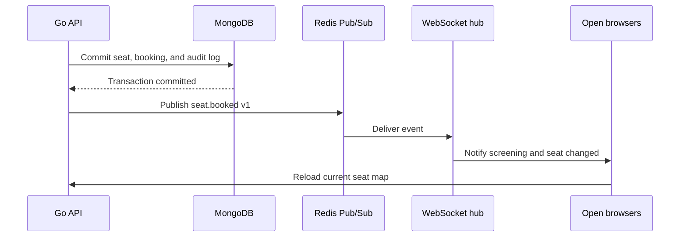

# Cinema ticket booking system

A take-home cinema booking system built with Go, Vue, MongoDB, and Redis. The main design goal is
to stop two users from booking the same seat while keeping every open seat map up to date.

## 1. System architecture diagram



The event subscriber and WebSocket hub run inside the Go API process. Nginx serves the built Vue
application and proxies `/api/` requests to the API container.

The source of truth is split by the lifetime of the data:

- MongoDB owns durable data: users, screenings, booked seats, bookings, and audit logs.
- Redis owns short-lived data: login sessions and seat holds with a TTL.
- Redis Pub/Sub and WebSocket messages are notifications. A browser reloads the seat map after an
  event instead of treating the event as stored state.

## 2. Tech stack overview

| Layer | Technology | Use in this project |
| --- | --- | --- |
| Backend | Go 1.26, Gin | HTTP API, authentication middleware, booking rules |
| Frontend | Vue 3, TypeScript, Pinia, Vue Router | Seat map, login state, admin dashboard |
| Database | MongoDB 8 replica set | Durable records and booking transactions |
| Distributed lock | Redis 8, go-redis | Atomic seat holds with a five-minute TTL |
| Realtime | WebSocket, Redis keyspace events | Notify open browsers when a seat changes |
| Message queue | Redis Pub/Sub | Publish the real `seat.booked` event after commit |
| Authentication | Google OAuth 2.0 | Create a user and issue a Redis-backed session |
| Web server | Nginx | Serve Vue and proxy API/WebSocket traffic |
| Deployment | Docker, Docker Compose | Start the complete local system with one command |
| Tests | Go testing, Vitest, Vue Test Utils | Backend rules, API access, stores, and UI behavior |

## 3. Booking flow

1. The user signs in with Google. The callback upserts the user in MongoDB and stores a random
   session token in Redis. The browser only receives an HttpOnly cookie.
2. The browser loads screenings and the current seat map from the API.
3. When the user chooses a seat, the API first checks that the screening and seat exist and that
   MongoDB does not already mark the seat as `BOOKED`.
4. Redis runs an atomic `SET ... NX` for `seat_lock:<screening_id>:<seat_id>`. The value is the user
   ID and the TTL is five minutes. A competing user receives HTTP `409`.
5. Redis keyspace events notify the WebSocket hub. Every open browser reloads the seat map and sees
   the seat as `LOCKED`.
6. Payment is mocked by the confirm button. Confirmation atomically changes the user's lock into a
   short booking claim before writing to MongoDB. A different user cannot use that claim.
7. One MongoDB transaction conditionally changes the embedded seat from `AVAILABLE` to `BOOKED`,
   inserts the booking, and inserts its `BOOKING_SUCCESS` audit log.
8. A partial unique index on `(screening_id, seat_id)` for `BOOKED` records is the last double-booking
   guard.
9. After the transaction commits, the API deletes its booking claim and publishes a versioned
   `seat.booked` event through Redis Pub/Sub. Browsers reload and display the durable `BOOKED` state.
10. If MongoDB fails before commit, the API restores the original hold for the time it had left. If
    the five-minute hold expires, Redis releases it automatically and the API records
    `BOOKING_TIMEOUT`.

Confirming the same completed booking again is idempotent for its owner. It returns the existing
booking without publishing a duplicate event.

## 4. Redis lock strategy

### Lock representation

```text
key:   seat_lock:<screening_id>:<seat_id>
value: <user_id>
ttl:   5 minutes
```

Each seat has a separate key. Redis `SET` with `NX` is atomic, so only the first request can create
the key. Retrying from the same user returns the current hold without extending its expiry time.

### Safe release

A plain `DEL` is unsafe. An old request could delete a newer user's lock after the first lock has
expired. Release therefore runs a Lua script that compares the stored owner with the current user
and deletes the key only when they match.

### Safe transition to a booking

Confirmation uses a second Lua script. It checks the owner, reads the remaining TTL, and replaces
the user ID with `booking_claim:<user_id>:<random_token>`. The claim lasts 15 seconds while the
MongoDB transaction has a 10-second timeout.

- On commit, another compare-and-delete script removes only that claim token.
- On a database error, a compare-and-set script restores the original user lock for its remaining
  time.
- A late release request cannot delete a claim or a newer user's hold.

Redis is the first concurrency gate, but it is not the only one. The MongoDB transaction updates
the seat only while its status is `AVAILABLE`, and the unique partial index rejects a second booked
record. These checks keep MongoDB correct even if two API requests reach the database unexpectedly.

If Redis is unavailable, new holds fail instead of bypassing the lock. This is intentional because
accepting an unlocked booking would risk double booking.

## 5. Message queue use case

The selected message queue is Redis Pub/Sub. It is used for `seat.booked`, not started as an unused
service.



The event includes `booking_id`, `screening_id`, `seat_id`, status, version, and occurrence time. It
is published only after MongoDB commits, so a failed booking cannot send a booked event.

Redis Pub/Sub has at-most-once delivery and does not store old messages. This is acceptable here
because MongoDB remains authoritative and every reconnect reloads the current seat map. A production
notification service that must never lose work would use a durable queue or an outbox pattern.

## 6. How to run

Docker Desktop is the only requirement for the complete local stack.

```powershell
Copy-Item .env.example .env
docker compose up --build
```

Open [http://localhost:3000](http://localhost:3000). The API is available at
[http://localhost:8080](http://localhost:8080).

The command starts:

- Vue and Nginx on port `3000`
- Go API on port `8080`
- MongoDB replica set on local port `27017`
- Redis on local port `6379`

Check readiness:

```powershell
Invoke-RestMethod http://localhost:8080/api/v1/health/ready
```

Stop the stack without deleting its data:

```powershell
docker compose down
```

### Google sign-in setup

The system starts without Google credentials, but sign-in stays disabled until they are configured.

1. Create a Web application client in Google Auth Platform.
2. Add `http://localhost:3000` as an authorized JavaScript origin.
3. Add `http://localhost:3000/api/v1/auth/google/callback` as an authorized redirect URI.
4. Keep the OAuth application in testing mode and add the Google account as a test user.
5. Set `GOOGLE_CLIENT_ID` and `GOOGLE_CLIENT_SECRET` in `.env`.
6. Rebuild the API and web containers with `docker compose up --build -d api web`.

Do not commit `.env` or the client secret. For HTTPS deployment, set `COOKIE_SECURE=true`.

### Admin setup

New accounts receive the `USER` role. Add the exact Google email to `.env` to promote an existing
or new account:

```dotenv
ADMIN_EMAILS=admin@example.com
```

Multiple addresses can be separated with commas. Rebuild the API after changing the value. The Go
API reloads the user from MongoDB on authenticated requests and rejects every admin request unless
the stored role is exactly `ADMIN`. The frontend route guard is only for navigation.

## 7. Assumptions and trade-offs

| Decision | Reason | Accepted cost |
| --- | --- | --- |
| Mock payment confirmation | The assignment tests booking correctness, not a payment provider | No payment webhook, refund, or reconciliation flow |
| One seat per booking | Keeps the concurrency case small and easy to verify | A multi-seat cart would need an ordered multi-key lock strategy |
| Seats embedded in a screening document | Allows one conditional seat update inside the booking transaction | Very large auditoriums would make the document and updates heavier |
| Single Redis container | Enough to demonstrate a lock shared by multiple API processes | It is not highly available; Redis failure stops new holds |
| Single-member MongoDB replica set | Transactions work locally with one Compose command | It demonstrates transactions, not database redundancy |
| Redis Pub/Sub for booked events | It is one of the allowed MQ choices and fits realtime notification | Delivery is at most once and there is no replay |
| Reload after every realtime event | MongoDB and Redis stay authoritative | Each event causes another API read |
| Admin allowlist in environment config | No separate role-management screen is needed for this assignment | Changing admins requires an environment update and API rebuild |
| Local cookies use `Secure=false` | OAuth works on `http://localhost` | Production must use HTTPS, `Secure=true`, and should add explicit CSRF protection |

All backend timestamps are stored in UTC. The browser formats them in the viewer's local timezone.
The seeded screenings are demonstration data. The project does not include cinema management,
refunds, pricing rules, or a real notification provider because those are outside the assignment.

## Audit events

| Event | Written when |
| --- | --- |
| `BOOKING_SUCCESS` | The booking transaction commits |
| `BOOKING_TIMEOUT` | A Redis seat hold expires |
| `SEAT_RELEASED` | The owner manually releases an active hold |
| `SYSTEM_ERROR` | An unexpected seat-lock storage operation fails |

Expected conflicts, such as a seat already held by another user, are not system errors.

## API reference

| Method | Path | Access | Purpose |
| --- | --- | --- | --- |
| `GET` | `/api/v1/health/live` | Public | Process health |
| `GET` | `/api/v1/health/ready` | Public | MongoDB and Redis readiness |
| `GET` | `/api/v1/auth/config` | Public | Whether Google sign-in is configured |
| `GET` | `/api/v1/auth/google` | Public | Start Google OAuth |
| `GET` | `/api/v1/auth/google/callback` | Public | Complete Google OAuth |
| `GET` | `/api/v1/auth/me` | Signed in | Current session user |
| `POST` | `/api/v1/auth/logout` | Public | Delete the current session if present |
| `GET` | `/api/v1/screenings` | Public | Upcoming screenings |
| `GET` | `/api/v1/screenings/:screeningID/seats` | Public | Durable seat state plus current locks |
| `POST` | `/api/v1/screenings/:screeningID/seats/:seatID/lock` | Signed in | Hold one seat |
| `DELETE` | `/api/v1/screenings/:screeningID/seats/:seatID/lock` | Signed in | Release the owner's hold |
| `GET` | `/api/v1/screenings/:screeningID/seat-events` | Public | WebSocket seat notifications |
| `POST` | `/api/v1/bookings` | Signed in | Confirm the current user's held seat |
| `GET` | `/api/v1/admin/bookings` | Admin | Paginated booking list and filters |
| `GET` | `/api/v1/admin/audit-logs` | Admin | Paginated audit log and event filter |

## Tests

Backend unit tests:

```powershell
cd backend
go test ./...
go vet ./...
```

Redis concurrency test against the running Compose Redis:

```powershell
cd backend
$env:REDIS_TEST_ADDRESS = "localhost:6379"
go test ./internal/seatlock -run TestRedisStoreAllowsOnlyOneWinnerForConcurrentSeatLock -count=20
Remove-Item Env:REDIS_TEST_ADDRESS
```

Each run starts 32 goroutines at the same time. The test requires one winner, 31
`ErrAlreadyLocked` results, and verifies that Redis stores the winning user as the owner. It uses
Redis database 15 and deletes its test key afterward.

MongoDB final double-booking guard test:

```powershell
cd backend
$env:MONGO_TEST_URI = "mongodb://localhost:27017/?replicaSet=rs0&directConnection=true"
go test ./internal/booking -run TestMongoRepositoryPreventsConcurrentDoubleBooking -count=10
Remove-Item Env:MONGO_TEST_URI
```

The test starts two booking transactions for different users on the same seat. It requires one
success and one `ErrSeatAlreadyBooked`, then checks that MongoDB contains one booking, one success
audit log, and a `BOOKED` seat. Every run uses a temporary database and drops it afterward.

Frontend checks:

```powershell
cd frontend
npm install
npm run lint
npm run test:unit -- --run
npm run build
```

To inspect the booked-event channel while confirming a seat in the browser:

```powershell
docker compose exec redis redis-cli SUBSCRIBE cinema:seat-events:v1
```

## Project layout

```text
backend/             Go API, domain rules, MongoDB, Redis, and tests
frontend/            Vue application, unit tests, and Nginx config
docker-compose.yml   Complete local stack
.env.example         Local configuration template without secrets
```
