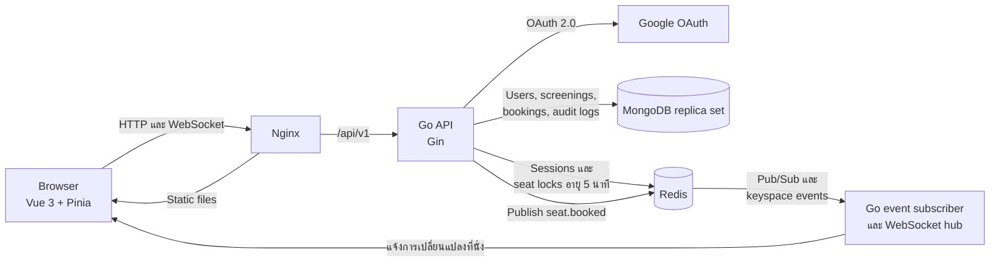
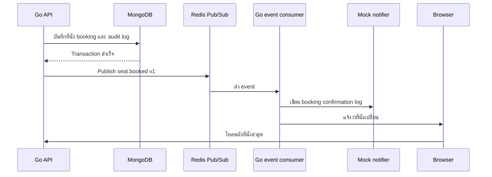

# Cinema ticket booking system

ระบบจองตั๋วภาพยนตร์สำหรับโจทย์ทดสอบ พัฒนาด้วย Go, Vue, MongoDB และ Redis ผู้ใช้เลือกที่นั่ง
พร้อมกันได้สูงสุด 6 ที่ ตรวจสอบราคาก่อนยืนยัน และเปิด E-Ticket แยกตามที่นั่งได้ ระบบป้องกัน
การจองที่นั่งซ้ำและอัปเดตผังที่นั่งของผู้ใช้ที่เปิดหน้าเว็บอยู่แบบ realtime

## 1. System Architecture Diagram (ภาพรวมสถาปัตยกรรม)



Event subscriber และ WebSocket hub ทำงานอยู่ใน process เดียวกับ Go API ส่วน Nginx ใช้เสิร์ฟ
Vue ที่ build แล้วและส่งต่อ request ที่ขึ้นต้นด้วย `/api/` ไปยัง API container

ระบบแยกที่เก็บข้อมูลตามอายุการใช้งาน:

- MongoDB เก็บข้อมูลถาวร เช่น ผู้ใช้ รอบฉาย ราคา สถานะที่นั่ง การจอง และ audit log
- Redis เก็บข้อมูลชั่วคราว ได้แก่ login session และการล็อกที่นั่งซึ่งมี TTL
- Redis Pub/Sub และ WebSocket ใช้แจ้งว่ามีข้อมูลเปลี่ยน เมื่อ browser ได้รับ event จะโหลดผังที่นั่ง
  ล่าสุดจาก API อีกครั้ง

## 2. Tech Stack Overview (เทคโนโลยีที่ใช้)

| ส่วนของระบบ | เทคโนโลยี | หน้าที่ |
| --- | --- | --- |
| Backend | Go 1.26, Gin | HTTP API, authentication middleware และกฎการจอง |
| Frontend | Vue 3, TypeScript, Pinia, Vue Router | เลือกหลายที่นั่ง, E-Ticket, login state และหน้า admin |
| Database | MongoDB 8 replica set | เก็บข้อมูลถาวรและรองรับ booking transaction |
| Distributed lock | Redis 8, go-redis | ล็อกที่นั่งแบบ atomic โดยมี TTL 5 นาที |
| Realtime | WebSocket, Redis keyspace events | แจ้ง browser เมื่อสถานะที่นั่งเปลี่ยน |
| Message queue | Redis Pub/Sub | ส่ง event `seat.booked` หลัง transaction สำเร็จ |
| Authentication | Google OAuth 2.0 | สร้างผู้ใช้และออก session ที่เก็บใน Redis |
| Web server | Nginx | เสิร์ฟ Vue และ proxy API/WebSocket |
| Deployment | Docker, Docker Compose | เปิดระบบในเครื่องด้วยคำสั่งเดียว |
| Tests | Go testing, Vitest, Vue Test Utils, Postman | ทดสอบ business rule, API, store และ UI |

## 3. Booking Flow (ขั้นตอนการจอง)

1. ผู้ใช้เข้าสู่ระบบด้วย Google จากนั้น callback จะสร้างหรืออัปเดตผู้ใช้ใน MongoDB และสร้าง
   session token แบบสุ่มไว้ใน Redis ฝั่ง browser จะได้รับเฉพาะ HttpOnly cookie
2. Frontend โหลดข้อมูลรอบฉาย ราคาต่อที่นั่ง และผังที่นั่งปัจจุบันจาก API
3. ผู้ใช้เลือกได้สูงสุด 6 ที่นั่ง การเลือกแต่ละที่นั่งจะสร้าง lock แยกกัน หากยกเลิกการเลือก
   ระบบจะปล่อย lock ของที่นั่งนั้น
4. API ตรวจว่ารอบฉายและที่นั่งมีอยู่จริง รวมถึงตรวจว่า MongoDB ยังไม่ได้บันทึกที่นั่งเป็น
   `BOOKED`
5. Redis ใช้ `SET ... NX` สร้าง key
   `seat_lock:<screening_id>:<seat_id>` แบบ atomic ค่าใน key คือ user ID และมี TTL 5 นาที
   หากมีคนล็อกไว้ก่อน API จะตอบ HTTP `409`
6. Redis keyspace event แจ้ง WebSocket hub แล้ว browser ทุกหน้าที่เปิดอยู่จะโหลดผังใหม่และเห็น
   ที่นั่งเป็น `LOCKED`
7. หน้ายืนยันแสดงจำนวนที่นั่ง ราคาต่อที่ และราคารวม ส่วนการชำระเงินใช้ปุ่มยืนยันจำลอง
   Frontend ส่ง request ยืนยันแยกตามที่นั่ง
8. ตอนยืนยัน ระบบเปลี่ยน lock เป็น booking claim ชั่วคราว จากนั้น MongoDB transaction จะเปลี่ยน
   ที่นั่งจาก `AVAILABLE` เป็น `BOOKED` สร้าง booking พร้อมสำเนาราคา และเพิ่ม audit log
   `BOOKING_SUCCESS`
9. Partial unique index ที่ `(screening_id, seat_id)` สำหรับ booking สถานะ `BOOKED`
   เป็นด่านสุดท้ายที่ป้องกันการจองซ้ำ
10. เมื่อ transaction สำเร็จ API จะลบ booking claim และ publish event `seat.booked` ผ่าน
    Redis Pub/Sub จากนั้น browser โหลดสถานะ `BOOKED` ล่าสุดจาก API
11. ถ้าการจองหลายที่นั่งสำเร็จเพียงบางรายการ ที่นั่งที่สำเร็จแล้วจะยังคงถูกจอง ส่วน UI จะแจ้ง
    รายการที่ไม่สำเร็จ เนื่องจากทั้งกลุ่มไม่ได้อยู่ใน transaction เดียวกัน
12. หาก MongoDB ผิดพลาดก่อนบันทึกสำเร็จ API จะคืน lock ตามเวลาที่เหลือ ถ้า lock ครบ 5 นาที
    Redis จะปล่อยให้อัตโนมัติและ API บันทึก `BOOKING_TIMEOUT`

หากเจ้าของ booking ส่งคำขอยืนยันรายการเดิมซ้ำ API จะตอบ booking เดิมกลับไปโดยไม่ publish
event ซ้ำ

### ราคา การเลือกหลายที่นั่ง และ E-Ticket

ข้อมูลรอบฉายเริ่มต้นกำหนดราคาไว้ที่ 200, 220, 240 หรือ 260 บาทต่อที่นั่ง API ส่งราคาใน field
`ticket_price_baht` และหน้าจองคำนวณราคารวมดังนี้:

```text
ราคารวม = ticket_price_baht x จำนวนที่นั่งที่เลือก
```

ตอนสร้าง booking ฝั่ง server จะคัดลอกราคาจากรอบฉายไปเก็บใน `price_baht` ทำให้ราคาบนตั๋วเดิม
ไม่เปลี่ยนตามหากมีการแก้ราคารอบฉายในภายหลัง

การยืนยันหนึ่งครั้งเลือกได้สูงสุด 6 ที่นั่ง แต่ API จะสร้าง booking แยกหนึ่งรายการต่อหนึ่งที่นั่ง
แต่ละรายการจึงมี booking ID, ราคา, ticket code และ E-Ticket ของตัวเอง โดย ticket code มีรูปแบบ
`TICKET-<booking_object_id>`

ผู้ใช้ที่เข้าสู่ระบบแล้วเปิดดูตั๋วเดิมได้จากเมนู **ตั๋วของฉัน** ภายในตั๋วมีชื่อภาพยนตร์ รอบฉาย
โรง ที่นั่ง และราคา Browser สร้าง QR จาก ticket code และมีปุ่มคัดลอกรหัสตั๋ว ระบบ QR ในงานนี้
เป็นตัวอย่างการแสดงตั๋วเท่านั้น ยังไม่มีเครื่องสแกนหรือ API สำหรับตรวจตั๋ว

## 4. Redis Lock Strategy (การล็อกที่นั่งด้วย Redis)

### รูปแบบของ lock

```text
key:   seat_lock:<screening_id>:<seat_id>
value: <user_id>
ttl:   5 minutes
```

แต่ละที่นั่งใช้ key แยกกัน คำสั่ง Redis `SET` พร้อม `NX` ทำงานแบบ atomic จึงมีเพียง request
แรกที่สร้าง key สำเร็จ หากผู้ใช้คนเดิมส่งซ้ำ ระบบจะคืน lock เดิมโดยไม่ต่ออายุ

### การปล่อย lock

การใช้ `DEL` โดยตรงมีความเสี่ยง เพราะ request เก่าอาจลบ lock ของผู้ใช้คนใหม่หลัง lock แรก
หมดอายุ ระบบจึงใช้ Lua script เปรียบเทียบเจ้าของใน Redis กับผู้ใช้ปัจจุบัน และลบเฉพาะเมื่อ
เป็นเจ้าของคนเดียวกัน

### การเปลี่ยน lock เป็น booking

ตอนยืนยัน booking จะมี Lua script อีกชุดสำหรับตรวจเจ้าของ อ่าน TTL ที่เหลือ และเปลี่ยนค่าเป็น
`booking_claim:<user_id>:<random_token>` claim มีอายุ 15 วินาที ขณะที่ MongoDB transaction
กำหนด timeout ไว้ 10 วินาที

- เมื่อ transaction สำเร็จ script จะลบเฉพาะ claim token ที่ตรงกัน
- ถ้า database ผิดพลาด script จะคืน user lock เดิมตาม TTL ที่เหลือ
- request ปล่อยที่นั่งที่มาช้าจะลบ claim หรือ lock ของผู้ใช้คนใหม่ไม่ได้

Redis เป็นด่านแรกของการป้องกันการจองซ้ำ แต่ไม่ใช่ด่านเดียว MongoDB transaction จะอัปเดตที่นั่ง
เฉพาะเมื่อสถานะยังเป็น `AVAILABLE` และ partial unique index จะปฏิเสธ booking `BOOKED`
รายการที่สอง

หาก Redis ใช้งานไม่ได้ ระบบจะไม่รับการล็อกใหม่ เพราะการปล่อยให้จองโดยไม่มี lock มีโอกาสทำให้
เกิดการจองซ้ำ

## 5. Message Queue (การนำไปใช้)

โปรเจกต์นี้เลือก Redis Pub/Sub และนำมาใช้กับ event `seat.booked`



ใน event มี `booking_id`, `screening_id`, `seat_id`, status, version และเวลาที่เกิดเหตุการณ์
API จะ publish หลัง MongoDB transaction สำเร็จเท่านั้น booking ที่บันทึกไม่สำเร็จจึงไม่ส่ง event

Redis Pub/Sub ส่งข้อมูลแบบ at-most-once และไม่เก็บข้อความเก่า ซึ่งเพียงพอสำหรับระบบนี้เพราะ
MongoDB เป็นข้อมูลหลัก และ browser จะโหลดผังที่นั่งใหม่ทุกครั้งที่เชื่อมต่อ หากนำไปใช้จริงกับ
งานที่ห้ามทำข้อความหาย ควรเปลี่ยนเป็น durable queue หรือใช้ outbox pattern

Consumer ตัวเดียวกันเรียก mock notification หลังตรวจสอบ event แล้ว โดยเขียน log รูปแบบนี้:

```text
MOCK_NOTIFICATION booking_confirmed booking_id=<id> screening_id=<id> seat_id=A1
```

Mock notification จะทำงานหลัง transaction สำเร็จ และเก็บเฉพาะ reference ของ booking
โดยไม่เขียนอีเมลหรือข้อมูล OAuth ลง log

## 6. วิธีรันระบบ

เครื่องที่ใช้รันทั้งระบบต้องติดตั้ง Docker Desktop

```powershell
Copy-Item .env.example .env
docker compose up --build
```

เปิดหน้าเว็บที่ [http://localhost:3000](http://localhost:3000) และเรียก API ได้ที่
[http://localhost:8080](http://localhost:8080)

คำสั่งด้านบนจะเปิด:

- Vue และ Nginx ที่ port `3000`
- Go API ที่ port `8080`
- MongoDB replica set ที่ local port `27017`
- Redis ที่ local port `6379`

ตรวจสอบความพร้อมของระบบ:

```powershell
Invoke-RestMethod http://localhost:8080/api/v1/health/ready
```

ปิดระบบโดยไม่ลบข้อมูล:

```powershell
docker compose down
```

### ตั้งค่า Google Sign-In

ระบบเปิดได้แม้ยังไม่มี Google credentials แต่ปุ่มเข้าสู่ระบบจะใช้งานไม่ได้จนกว่าจะตั้งค่า

1. สร้าง OAuth client ประเภท Web application ใน Google Auth Platform
2. เพิ่ม `http://localhost:3000` ใน Authorized JavaScript origins
3. เพิ่ม `http://localhost:3000/api/v1/auth/google/callback` ใน Authorized redirect URIs
4. ตั้ง OAuth application เป็น testing และเพิ่ม Google account ที่จะใช้เป็น test user
5. กำหนด `GOOGLE_CLIENT_ID` และ `GOOGLE_CLIENT_SECRET` ในไฟล์ `.env`
6. Build API และ web container ใหม่ด้วย `docker compose up --build -d api web`

ห้าม commit ไฟล์ `.env` หรือ client secret หากนำระบบไปเปิดผ่าน HTTPS ให้ตั้ง
`COOKIE_SECURE=true`

### ตั้งค่า Admin

บัญชีใหม่จะมี role เป็น `USER` หากต้องการให้บัญชีเป็น admin ให้เพิ่มอีเมล Google ใน `.env`:

```dotenv
ADMIN_EMAILS=admin@example.com
```

ถ้ามีหลายอีเมลให้คั่นด้วย comma และ build API ใหม่หลังแก้ค่า เมื่อมี authenticated request
Go API จะโหลดผู้ใช้จาก MongoDB และอนุญาต admin endpoint เฉพาะ role `ADMIN` เท่านั้น
route guard ฝั่ง frontend มีไว้ควบคุมการนำทาง ไม่ได้ใช้แทนการตรวจสิทธิ์ของ API

## 7. Assumptions & Trade-offs (ข้อสมมติและข้อแลกเปลี่ยน)

| การตัดสินใจ | เหตุผล | ข้อจำกัด |
| --- | --- | --- |
| ใช้ปุ่มยืนยันแทนระบบชำระเงินจริง | แสดงการคำนวณราคาได้โดยไม่ต้องเชื่อม payment provider | ไม่มี webhook, refund และ reconciliation |
| หนึ่ง booking ต่อหนึ่งที่นั่ง และเลือกได้ไม่เกิน 6 ที่ | ใช้ lock, transaction และ unique index ชุดเดียวกันได้ | การจองหลายที่นั่งอาจสำเร็จเพียงบางรายการ |
| ราคาคงที่ต่อรอบฉาย | แสดง price snapshot บนตั๋วได้โดยไม่ต้องสร้าง pricing engine | ไม่มีระดับราคา โปรโมชัน ค่าธรรมเนียม หรือ dynamic pricing |
| Frontend สร้าง QR ของ E-Ticket | ผู้ใช้เปิดตั๋วเดิมและแสดงรหัสได้ | ยังไม่มี scanner หรือ validation endpoint |
| เก็บที่นั่งไว้ใน screening document | อัปเดตที่นั่งแบบมีเงื่อนไขใน transaction เดียวได้ | โรงขนาดใหญ่มากจะทำให้ document และการอัปเดตหนักขึ้น |
| ใช้ Redis container เดียว | เพียงพอสำหรับแสดง distributed lock ระหว่างหลาย API process | ไม่มี high availability และล็อกใหม่ไม่ได้หาก Redis ล่ม |
| ใช้ MongoDB replica set แบบ member เดียว | ใช้ transaction ในเครื่องได้ด้วย Compose | ไม่ได้แสดง database redundancy |
| ใช้ Redis Pub/Sub | เป็นตัวเลือก MQ ตามโจทย์และเหมาะกับ realtime notification | ส่งแบบ at-most-once และ replay ไม่ได้ |
| Mock notification เขียน API log | แสดง flow ที่ถูกเรียกจาก MQ โดยไม่ต้องมี provider credentials | ไม่ durable และหลาย API replica อาจเขียนซ้ำ |
| โหลดข้อมูลใหม่เมื่อได้รับ realtime event | ให้ MongoDB และ Redis เป็นข้อมูลหลัก | ทุก event ทำให้เกิด API read เพิ่ม |
| กำหนด admin ด้วย environment config | ไม่ต้องเพิ่มหน้าจัดการ role สำหรับโจทย์นี้ | เปลี่ยน admin แล้วต้อง build API ใหม่ |
| Local cookie ใช้ `Secure=false` | Google OAuth ทำงานผ่าน `http://localhost` ได้ | Production ต้องใช้ HTTPS, `Secure=true` และควรเพิ่ม CSRF protection |

เวลาจาก backend เก็บเป็น UTC และ browser แสดงตาม timezone ของผู้ใช้ ข้อมูลรอบฉายเป็นข้อมูล
ตัวอย่าง โปรเจกต์นี้ยังไม่มีระบบจัดการโรง คืนเงิน dynamic pricing ตรวจตั๋ว หรือ notification
provider จริง เพราะอยู่นอกขอบเขตของโจทย์

## Optional ที่ทำเพิ่ม

| รายการ | สิ่งที่มีในโปรเจกต์ |
| --- | --- |
| Postman Collection | มี collection 13 requests พร้อม test scripts ที่ `postman/Cinema-ticket-booking.postman_collection.json` |
| Simple Test Case | มี Go unit/integration tests และ Vue component/store tests ดูคำสั่งและตัวอย่างในหัวข้อ **การทดสอบ** |
| Notification | มี mock notification ที่ทำงานจาก `seat.booked` event หลัง MongoDB transaction สำเร็จ |

ตัวอย่าง test ที่อ่าน flow ได้โดยตรง:

- [Redis lock service test](backend/internal/seatlock/service_test.go)
- [MongoDB double-booking integration test](backend/internal/booking/mongodb_repository_integration_test.go)
- [Booking API test](backend/internal/transport/http/booking_handler_test.go)
- [Vue screening store test](frontend/src/__tests__/ScreeningStore.spec.ts)
- [Mock notification test](backend/internal/notification/mock_sender_test.go)

## Audit events

| Event | บันทึกเมื่อ |
| --- | --- |
| `BOOKING_SUCCESS` | Booking transaction สำเร็จ |
| `BOOKING_TIMEOUT` | Seat lock ใน Redis หมดอายุ |
| `SEAT_RELEASED` | เจ้าของปล่อย seat lock ก่อนหมดเวลา |
| `SYSTEM_ERROR` | เกิดข้อผิดพลาดที่ไม่คาดคิดระหว่างจัดการ seat lock |

กรณีที่คาดไว้ เช่น ที่นั่งถูกผู้ใช้อื่นล็อกอยู่แล้ว จะไม่ถูกนับเป็น system error

## API

| Method | Path | สิทธิ์ | ใช้สำหรับ |
| --- | --- | --- | --- |
| `GET` | `/api/v1/health/live` | Public | ตรวจว่า process ทำงานอยู่ |
| `GET` | `/api/v1/health/ready` | Public | ตรวจ MongoDB และ Redis |
| `GET` | `/api/v1/auth/config` | Public | ตรวจว่าตั้งค่า Google Sign-In แล้วหรือยัง |
| `GET` | `/api/v1/auth/google` | Public | เริ่ม Google OAuth |
| `GET` | `/api/v1/auth/google/callback` | Public | จบขั้นตอน Google OAuth |
| `GET` | `/api/v1/auth/me` | Signed in | อ่านข้อมูลผู้ใช้ของ session ปัจจุบัน |
| `POST` | `/api/v1/auth/logout` | Public | ลบ session ปัจจุบันหากมีอยู่ |
| `GET` | `/api/v1/screenings` | Public | อ่านรายการรอบฉาย |
| `GET` | `/api/v1/screenings/:screeningID/seats` | Public | อ่านสถานะที่นั่งถาวรรวมกับ lock ปัจจุบัน |
| `POST` | `/api/v1/screenings/:screeningID/seats/:seatID/lock` | Signed in | ล็อกหนึ่งที่นั่ง |
| `DELETE` | `/api/v1/screenings/:screeningID/seats/:seatID/lock` | Signed in | ปล่อยที่นั่งของผู้ใช้ปัจจุบัน |
| `GET` | `/api/v1/screenings/:screeningID/seat-events` | Public | WebSocket สำหรับการเปลี่ยนแปลงที่นั่ง |
| `POST` | `/api/v1/bookings` | Signed in | ยืนยันหนึ่งที่นั่งและคืนราคาพร้อม ticket code |
| `GET` | `/api/v1/bookings/me` | Signed in | อ่าน E-Ticket ของผู้ใช้ปัจจุบัน |
| `GET` | `/api/v1/admin/bookings` | Admin | อ่านรายการ booking แบบแบ่งหน้าและกรองข้อมูล |
| `GET` | `/api/v1/admin/audit-logs` | Admin | อ่าน audit log แบบแบ่งหน้าและกรอง event |

## การทดสอบ

ทดสอบ Backend:

```powershell
cd backend
go test ./...
go vet ./...
```

ทดสอบ Redis concurrency กับ Redis ที่เปิดผ่าน Compose:

```powershell
cd backend
$env:REDIS_TEST_ADDRESS = "localhost:6379"
go test ./internal/seatlock -run TestRedisStoreAllowsOnlyOneWinnerForConcurrentSeatLock -count=20
Remove-Item Env:REDIS_TEST_ADDRESS
```

แต่ละรอบจะเริ่ม goroutine 32 ตัวพร้อมกัน ผลที่คาดไว้คือล็อกสำเร็จหนึ่งรายการและอีก 31 รายการ
ได้รับ `ErrAlreadyLocked` จากนั้น test จะตรวจว่า Redis เก็บผู้ชนะเป็นเจ้าของ lock จริง
test ใช้ Redis database 15 และลบ key หลังจบ

ทดสอบด่านสุดท้ายที่ป้องกัน double booking ใน MongoDB:

```powershell
cd backend
$env:MONGO_TEST_URI = "mongodb://localhost:27017/?replicaSet=rs0&directConnection=true"
go test ./internal/booking -run TestMongoRepositoryPreventsConcurrentDoubleBooking -count=10
Remove-Item Env:MONGO_TEST_URI
```

Test จะเริ่ม booking transaction สองรายการจากคนละผู้ใช้บนที่นั่งเดียวกัน ผลที่คาดไว้คือสำเร็จ
หนึ่งรายการและอีกหนึ่งรายการได้ `ErrSeatAlreadyBooked` แล้วตรวจว่า MongoDB มี booking หนึ่งรายการ
audit log `BOOKING_SUCCESS` หนึ่งรายการ และที่นั่งเป็น `BOOKED` แต่ละรอบใช้ database ชั่วคราว
และลบทิ้งหลังจบ

ตรวจ Frontend:

```powershell
cd frontend
npm install
npm run lint
npm run test:unit -- --run
npm run build
```

ดู event ระหว่างยืนยันที่นั่งใน browser:

```powershell
docker compose exec redis redis-cli SUBSCRIBE cinema:seat-events:v1
```

ดู mock notification:

```powershell
docker compose logs -f api | Select-String MOCK_NOTIFICATION
```

## Postman collection

นำไฟล์
[Cinema-ticket-booking.postman_collection.json](postman/Cinema-ticket-booking.postman_collection.json)
เข้า Postman ภายใน collection มี request และ test script 13 รายการ ทำงานตามลำดับดังนี้:

1. ตรวจ API, MongoDB และ Redis
2. ตรวจ OAuth config และ admin session ปัจจุบัน
3. โหลดรอบฉาย เลือกที่นั่งว่าง ล็อกและปล่อย จากนั้นล็อกและยืนยัน booking
4. ค้นหา booking ที่สร้างใหม่จาก movie filter ในหน้า admin และตรวจ audit log
5. ออกจากระบบหลัง request อื่นทำงานครบ

Request ที่ต้องยืนยันตัวตนต้องใช้ local session:

1. ตั้ง `ADMIN_EMAILS` แล้วเข้าสู่ระบบที่ [http://localhost:3000](http://localhost:3000)
2. เปิด Developer Tools ใน browser แล้วไปที่ Application, Cookies,
   `http://localhost:3000`
3. คัดลอกค่า `cinema_session` ไปใส่ collection variable ชื่อเดียวกันใน Postman
4. Run collection จากบนลงล่าง

ไฟล์ collection ใน repository เว้นค่า `cinema_session` ไว้ ห้าม commit หรือส่งต่อ session จริง
Collection จะจองหนึ่งที่นั่งว่าง จึงควรใช้กับข้อมูลในเครื่อง ไม่ควรรันกับ environment ที่ใช้ร่วมกัน

## โครงสร้างโปรเจกต์

```text
backend/             Go API, domain rules, MongoDB, Redis และ tests
frontend/            Vue application, unit tests และ Nginx config
postman/             Postman collection พร้อม test scripts
docker-compose.yml   ตั้งค่า service สำหรับเปิดระบบในเครื่อง
.env.example         ตัวอย่าง local config ที่ไม่มี secret
```
